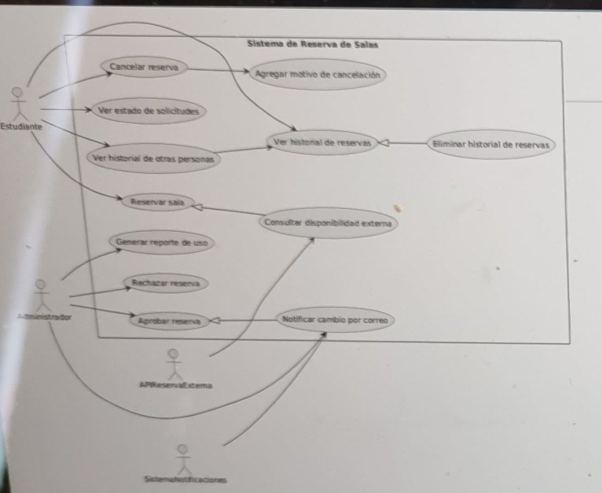
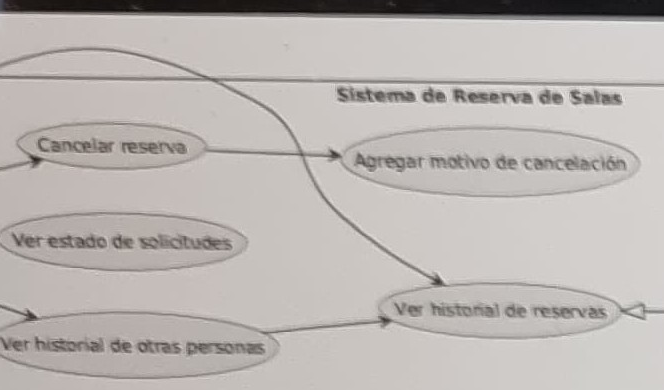
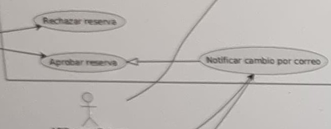
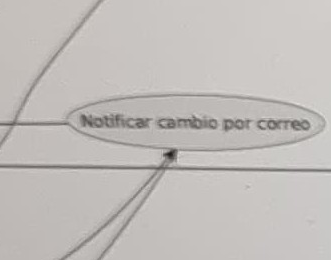
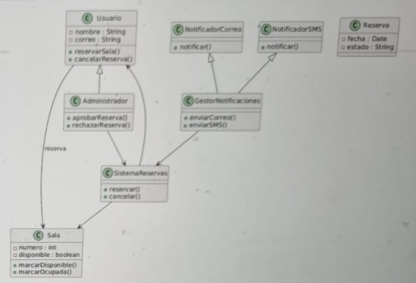
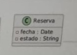
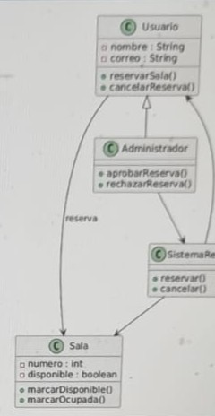
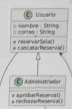

# Diagnosticar-Corregir-y-Justificar

### Estudiante:
- Jose Cornejo - Patrones de Diseño (Seccion 2)

## ✅ Descripción General del Repositorio
el proposito de este es el diagnostico y correccion de errores y justificacion de soluciones sobre un caso en un contexto de trabajo universitario con nota.

## Escenario Base: Sistema de Reserva de Salas
"un instituto desea implementar un sistema digital para que estudiantes y personal puedan reservar salas de estudio"
"el sistema debe permitir:"
- reservar una sala en un horario disponible
- cancelar una reserva (opcionalmente con motivo)
- ver historial de reservas
- el administrador puede aprobar o rechazar reservas
- el sistema puede enviar notificaciones por correo al usuario si hay cambios

### Diagrama Casos de Uso
- original (Con errores):

### Correccion Caso de uso:
1. primer error: el diagrama no cuenta con declaraciones de `<<include>>` y `<<extend>>` propias de un Caso de Uso
2. segundo error: el diagrama cuenta con una parte donde las flechas se cruzan entre si, esto no deberia ocurrir en un caso de uso puesto a que estan diseñados para entenderse a simple vista. puede verlo en el recorte a continuacion:
  
3. tercer error: abajo en el diagrama, 2 flechas convergen en una sola, otra mala practica al momento de realizar un diagrama caso de uso. puede verlo en el recorte a continuacion:

### Diagrama de Clases
- original (Con errores):

### Correccion Clases:
1. primer error: la clase reserva no esta conectada a ninguna otra clase. puede verlo en el recorte a continuacion:
.
2. segundo error: la asociacion entre la clase usuario y sala es la unica que tiene un texto descriptivo
.
3. tercer error: la clase usuario hereda de administrador, cuando deberia ser al reves:
. 
